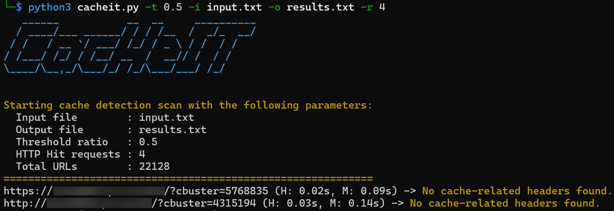

# CacHeIT
**CacHeIT** is a timing-based tool that identifies potential reverse proxy/CDN caching behavior on a list of URLs.

For each target URL, the script:

1. Sends an initial HTTP request (baseline measurement).
2. Sends multiple follow-up requests.
3. Compares response times.
4. Checks for known cache-related response headers (e.g. `CF-Cache-Status`, `X-Cache`, `Akamai-Cache-Status`).
5. Reports URLs that likely returned a cached response.

If the median response time of subsequent requests is significantly lower than the baseline (based on a configurable threshold), the script flags the URL as potentially cached.

Detected cache-related headers are included in the output.

## Detection Logic
A URL is considered potentially cached when:
```bash
median_hit_time <= threshold × baseline_time
```

Default threshold: `0.5 (50%)`

In addition to timing analysis, the script inspects response headers such as:

* `CF-Cache-Status`
* `X-Cache`
* `X-Cache-Hits`
* `Akamai-Cache-Status`
* `Age`
* `X-Proxy-Cache`

When present, these headers are reported alongside the URL.

## Installation
```bash
pip3 install -r requirements.txt
```

## Run the Script
### `input.txt`
```bash
https://example1.com:8080
http://example1.com:80/
https://example2.com:8443/
...
https://exampleN.com
```

### Command line
```bash
python3 cacheit.py -i cache_input.txt -o results.txt -t 0.3 -r 4
```

| Argument | Description                | Default                       |
| -------- | -------------------------- | ----------------------------- |
| `-i`     | Input file containing URLs | `input.txt`                   |
| `-o`     | Output file for results    | `cache_detection_results.txt` |
| `-t`     | Timing ratio threshold     | `0.5` (very aggressive)       |
| `-r`,`--hits`     | Number of HTTP requests after the baseline to detect HITs | `2` |

### Output


`cache_detection_results.txt`:
```bash
https://example1.com:8080/?cbuster=448644 (H: 0.05s, M: 0.13s) -> X-Cache-Hits: 1 (Fastly)
https://example2.com:8443/?cbuster=588742 (H: 0.07s, M: 0.16s) -> X-Cache-Hits: 1 (Fastly)
http://example2.com:80/?cbuster=262672 (H: 0.04s, M: 0.25s) -> X-Cache: Hit from cloudfront (Akamai, CloudFront (AWS), Fastly, Varnish)
...
https://exampleN.com/?cbuster=684778 (H: 0.1s, M: 0.4s) -> X-Cache: Hit from cloudfront (Akamai, CloudFront (AWS), Fastly, Varnish)
```

with the following format:
```bash
URL (H: median_hit_time, M: baseline_time) -> Header: value (Identified_Cache_Technology)
```